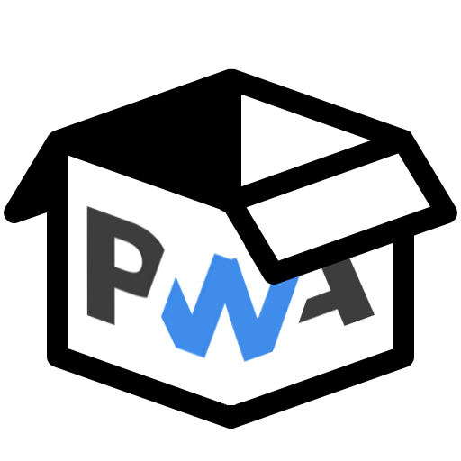

<div align="center">

# PWA Box



> Progressive Web App assets generator

</div>

## :car: Roadmap

- [ ] README.md Documentation :pencil:
- [ ] Generate Web App Manifest :clipboard:
- [ ] Generate Web App icons :hash:
- [ ] Generate Meta tags for Safari :apple:
- [ ] Generate Splash images for Apple devices :green_apple:

## :computer: Development

```bash
# install dependencies
npm install

# serve with hot reload at localhost:8080 or electron serve
npm run serve
npm run electron:serve

# build (web/electron)
npm run build
npm run electron:build
```

## :key: License

[MIT](LICENSE)

---

- LOGO Image: [icons8](https://icons8.com/icon/112470/box) box icon + [PWA Logo](https://github.com/webmaxru/progressive-web-apps-logo) (By [Geunhyeok LEE](https://github.com/leegeunhyeok))
- Font: [Google Fonts - Quicksand](https://fonts.google.com/specimen/Quicksand)
